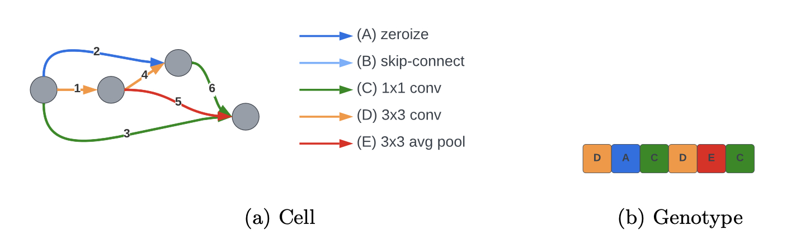

# NAS-Landscapes
Data and scripts for fitness landscape analysis of a neural architecture search (NAS) benchmark (NATS-Bench).

This repo contains data and R scripts related to the paper:

Gabriela Ochoa, Nadarajen Veerapen (2022) [Neural Architecture Search: A Visual Analysis.](https://link.springer.com/chapter/10.1007/978-3-031-14714-2_42) Parallel Problem Solving from Nature - PPSN XVII 603-615 [[PDF](assets/PPSN_2022_NAS_Landscapes.pdf)]

Where we conduct a fitness landscape analysis and visualisation of the NAS topology search space proposed in this article:

Dong, X., Liu, L., Musial, K., Gabrys, B (2022)[NATS-Bench: benchmarking NAS algorithms for architecture topology and size](https://ieeexplore.ieee.org/abstract/document/9336247). *IEEE Trans. Pattern Anal. Mach. Intell.* 7, 3634–3646

## The NATS-Bench Topology Search Space
This search space was inspired by the successful cell-based NAS algorithms, it consists of a predefined macro skeleton (Fig. 1) where modular (searchable) cells are stacked. 

Fig. 1: The macro skeleton of candidate architectures in the search space. The skeleton is shared by all architectures and only the configuration of the cell (visualised in red) is subject to change

A cell is represented as a dense directed acyclic graph (DAS) with 4 nodes and 6 edges (Fig. 2 (a)). Edges in this DAS are  associated with operations that transforms the feature map from the start to the end node. Operations are selected from a predefined set of five: (A) zeroize, (B) skip connection, (C) 1×1 convolution, (D) 3×3 convolution, and (E) 3×3 average pooling layer. 
 
Fig.2: Encoding of an example architecture showing the mapping from a cell to the corresponding linear genotype. (a) A cell is represented as DAG with six edges representing operations taken from a fixed set of five operations (A – E) as indicated in the legend. (b) A candidate solution (genotype) is encoded as a string of six symbols, each representing the operation associated with the numbered edge in the DAG. 

Since each edge can be one of 5 operations, the search space contains $5^6 = 15,625$ unique neural architectures. Each architecture was trained three times using different random seeds on three popular image classification datasets: CIFAR-10, CIFAR- 100, and ImageNet-16-120. The benchmark provides pre-computed train, validation, and test accuracies, loss error and other metrics for each architecture, seed and image dataset.

## Fitness Landscape Analysis
A fitness landscape is a triplet $(S, N, f)$ where
* $S$ is a set of admissible solutions i.e., a search space 
* $N: S \longrightarrow 2^S$, is a neighbourhood structure, a function that assigns a set of neighbours $N(s)$ to every solution $s \in S$ 
* $f : S \longrightarrow \mathbb{R}$ is a fitness function that measures the quality of the corresponding solutions. 
 
We define below these three components for our NAS formulation.

*Search space*. The search space consists of strings of length $n = 6$ (the number of edges in the DAG representing the cell in the alphabet  $\Sigma$ = {A, B, C, D, E}, where each symbol represents a predefined operation. An example genotype is given in Fig. 2 (b), where the symbol at position $i$ corresponds to the operation associated to edge $i$ in the DAG. The size of the search space is $|\Sigma|^n$, that is, $5^6 = 15,625$, as indicated above.

*Neighbourhood Structure*. We use the standard Hamming distance 1 neighbourhood (1-change operator). The Hamming distance between two strings is the number of positions in which they differ. Therefore, the neighbourhood $N(s)$ of solution $s$ includes the set of all solutions at a maximum Hamming distance  1 from $s$. The size of the neighbourhood is $n \times (|\Sigma| - 1)$, that is, $6 \times 4 = 24$. 

*Fitness Function*. To measure the performance of each cell we consider the validation accuracy metric, to be maximised. In NATS-Bench, every architecture (cell) was independently trained three times using three different random seeds. Therefore, there are three sets of metrics for each image dataset. We are interested in exploring the effect of noise in the fitness landscape, we consider two ways to draw the validation metric: (i) using a single value, and (ii) using the average of the three values to obtain a less noisy estimate.  

We therefore used two fitness functions:
* $f_{sng}$ the validation accuracy corresponding to a single training seed (seed 1 provided in the benchmark).
* $f_{avg}$ the validation accuracy corresponding to the average of three training seeds provided in the benchmark. 

We analysed the fitness landscapes using three techniques not previously used in this setting: 
1. Density of states (DOS) 
2. Fitness-distance correlation (FDC) 
3. Local optima networks (LONs) 

These techniques explore the landscape global structure and have a strong visual component.

## Structure of the Repository
There are two folders: **data** and **scripts** as described below.
### Data 
Contains three folders 
* **accuracy**: has six csv files corresponding to the 3 image datasets and the 2 fitness functions. Each file contains columns for the solution representation (genotype),  the validation accuracy (as well as several other metrics) for each of the 15,625 architectures.
* **genotype**: has six csv files corresponding to the 3 image datasets and the best 1% and worst 1% architectures as ranked by the $f_{avg}$ fitness values. Each file contains columns for the solution and the two fitness functions.
* **lon**: has six zip files corresponding to the 3 image datasets and the the 2 fitness functions. Each zip file contains a set of (1,000) run files representing the sampling process to construct local optima networks (LONs). Each run file has four columns which correspond to the solution and fitness value of the start and end local optima in the search trajectory of an iterated local search algorithm.

### Scripts
There are 5 R scripts as described below. The plotting scripts save plots as pdf (or png) files in a directory named "plots/". You need to create a local folder named "plots/" before running the scripts.
* [dos_plot.R](scripts/dos_plot.R) Reads accuracy data (from the "data/accuracy/" folder) for all datasets and the two fitness functions and produces density of states (dos) plots. 
* [fdc_plot.R](scripts/fdc_plot.R) Reads accuracy and genotype data (from the "data/accuracy/" folder) for all datasets and the two fitness functions and produces fitness distance correlation (fdc) plots, a regression line and the Spearman's correlation coefficient is added in each plot. 
* [genotype_plot.R](scripts/genotype_plot.R) Reads accuracy and genotype data (from the "data/genotype/" folder) for all datasets and the best and worst portions of the search space, and produces coloured genotype heat-maps. 
* [lon_create.R](scripts/lon_create.R) Reads run logs (from the "data/lon/" folder) for all datasets and the two fitness functions and constructs local optima networks (LON) graph objects. The LON graphs are saved within .RData files in a directory called "lons/". You need to create a local folder named "lons/" before running this script.
* [lon_plot.R](scripts/lon_plot.R) Reads LON graph objects (from .RData files in the "lons/" folder) for all datasets and the two fitness functions and produces network plots in 2D and 3D. 

